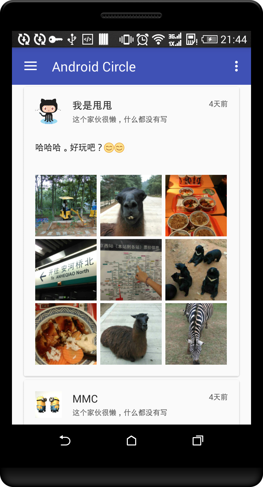
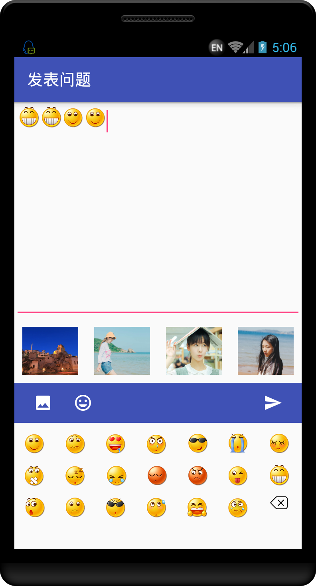
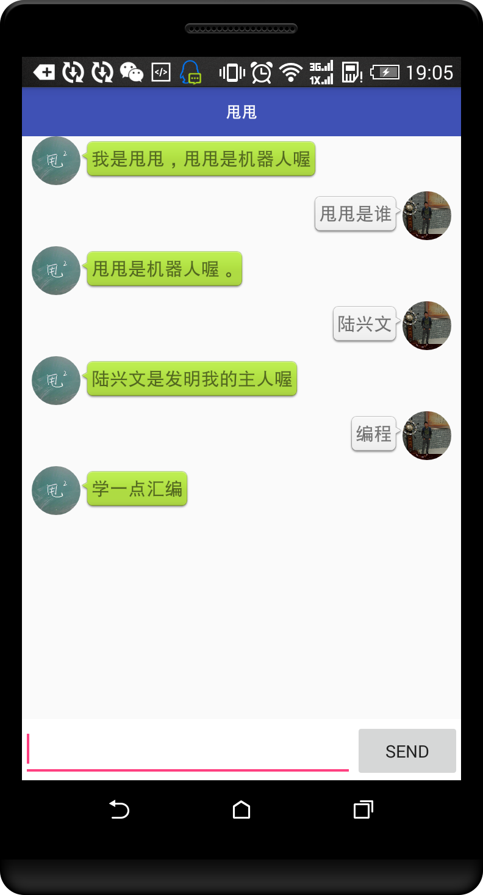
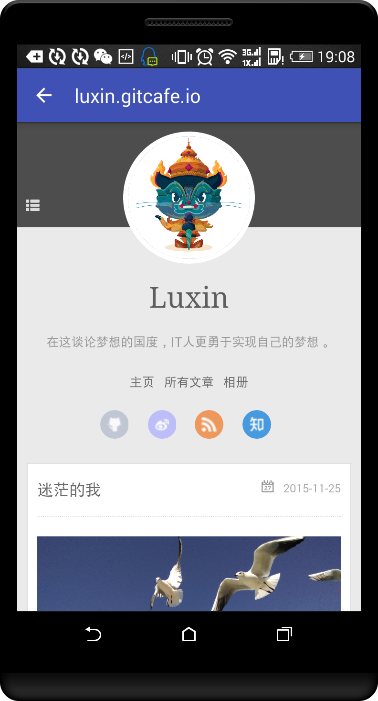
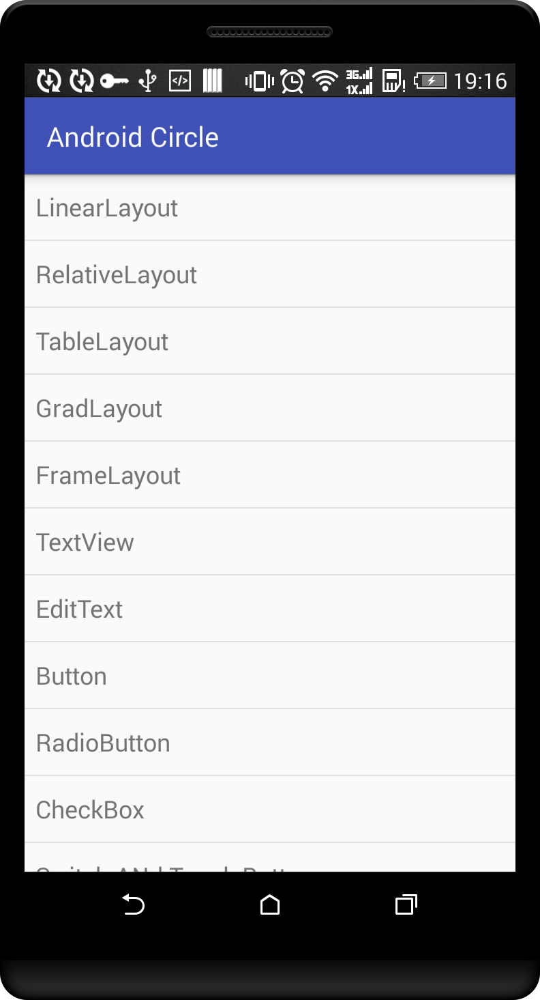

## 写在前面的话
这个本是我期末的Android作业，所以开始在创建工程的时候。创建的是qimo这样的一个工程，所以我的所有Activity代码都在qimo这个包下面。发现有的文件夹文件也和qimo扯上关系，大家知道qimo的由来就行。
这也是我在github上面提交的第一个项目，以前都是在这上面download别人的源码。

## 关于这个项目
目前完成的功能不多，而且项目中存在很多bug也是很正常的。我也是一名学习Android的新手，虽然接触的时间有点长了，但是在学校大多时间都被ACM还有蓝桥杯这类的程序设计竞赛浪费了。现在开始重拾Android，这个项目都是我在学习当中写的列子程序。之所以把它集成进来是因为我不想创建很多工程，而一些工程因为学习缘故可能只有几个类，几个布局文件。

把它命名为AndroidCircle，一是我的期末作业也做不能叫qimo吧？二是，也希望通过这个项目建立一个Android的开发者圈子，也希望此项目能够在学习上或者在你的项目上对你有所帮助。这我也是很高兴的。毕竟我也是在github上下载过很多代码的。
最后也希望我通过这个项目让自己的基础增强。

**最后，这个项目我会一直维护下去**

最近可能不会有任何提交，因为我要复习期末考试了。争取不挂科哈，回家好好过年。

## 如何让项目运行
此项目是基于bmob开发，希望大家可以到www.bmob.cn上申请账号，新建新的项目，然后把key替换上。
里面有一个聊天的机器人，这个也是需要自己到图灵机器人上注册账号，把key填写上，它才能得以正常工作。

项目有推送功能，这个也需要自己到Bmob上的应用面板上把推送功能打开才能保证这个功能正常使用。

## 项目运行截图

## 感谢
* 鸿洋大牛的blog: http://blog.csdn.net/lmj623565791
* 头像裁剪库：https://github.com/jdamcd/android-crop
* 圆形头像：https://github.com/hdodenhof/CircleImageView
* 下拉刷新上拉加载：https://github.com/android-cjj/Android-MaterialRefreshLayout
* Glide: https://github.com/bumptech/glide